# MySQL Web Frontend v1.0.1b1
A Web Interface for a MySQL Server

## Setup
### Initial
1. Install Dependencies with `npm i`
2. Create `src/config.json`
3. Add the Following Data into `config.json`
```json
{
  "ssl": "/etc/letsencrypt/live/[YOUR DOMAIN NAME]",
  "server": {
    "ip": "[MYSQL IP ADDRESS]",
    "port": "3306"
  },
  "auth": {
    "username": "[MYSQL USERNAME]",
    "password": "[MYSQL PASSWORD]"
  }
}
```
`ssl`: The location of your SSL Certificates in your server

`server.ip`: The IP Address to your MySQL Server

`server.port`: The Access Port to your MySQL Server (usually 3306)

`auth.username`: The Username to access your MySQL Server

`auth.password`: The Password to access your MySQL Server

**Make sure the MySQL User has at least `ALTER`, `CREATE`, `DELETE`, `INSERT`, `SELECT`, and `UPDATE` privileges to the Databases you want accessible through the web interface, as well as the `auth` Database**

***Also Ensure that each database has a Primary Key Column named ID or most of the features will not work***

## Using The Web Interface

### Registering Your First User

After setting up the Web-Interface for the first time, you will need to create a User Account, This will be the Login info you will use to log into the database. After hitting Register, the App will create a Schema named `auth` with a table named `accounts` on your database where all user accounts will be stored. You can add more later on.

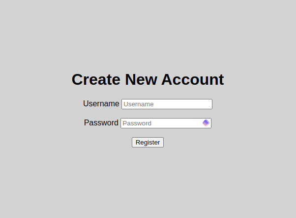

### Logging in

To Log into the Web Interface you can use the Username and Password you just defined above

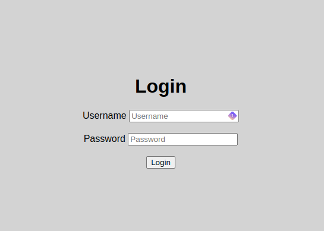

### Navigating the Database

Once Logged in You will be able to access All of the databases where you have `SELECT` Privileges on

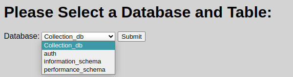

After selecting a database, you will be able to choose a table in that database

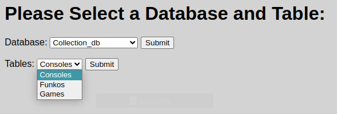

After Selecting a table you will be able to see all of the data inside the table

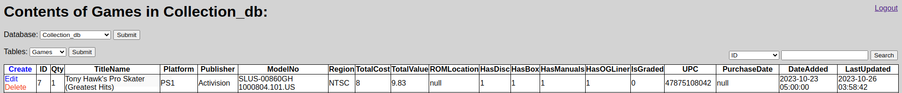

You can also click on the header to sort by that column

### Searching

Above the table to the Right there is a search bar, you can select which column to search and the query you would like to search

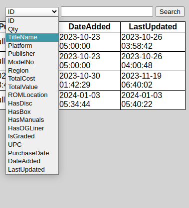
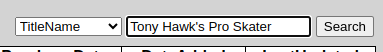
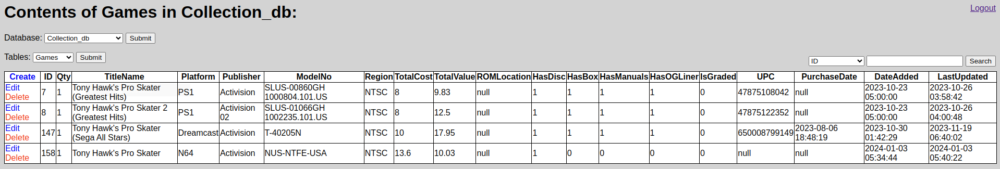

### Creating/Editing/Deleting an Entry

The First Column of the table is a Dedicated Action Column, here you can find the Create, Edit, and Delete buttons

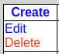

Create and Edit open a similar page, the only difference is the create page is not prefilled with record data

Here you can manually add or change information in a record

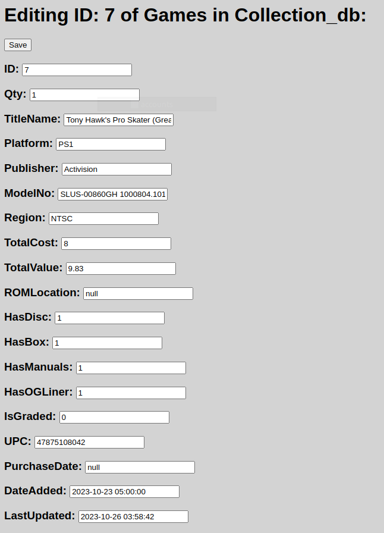

The Delete Button will first show you a confirmation through your browser

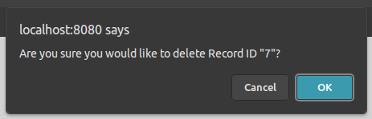

Hitting Cancel wont do anything, hitting Okay will send you to another page where you will need to type in the ID of the record you want to delete

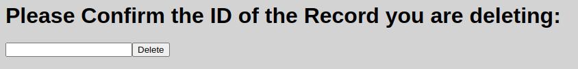

After hitting delete the record will no longer be shown and you will be returned to the table screen

